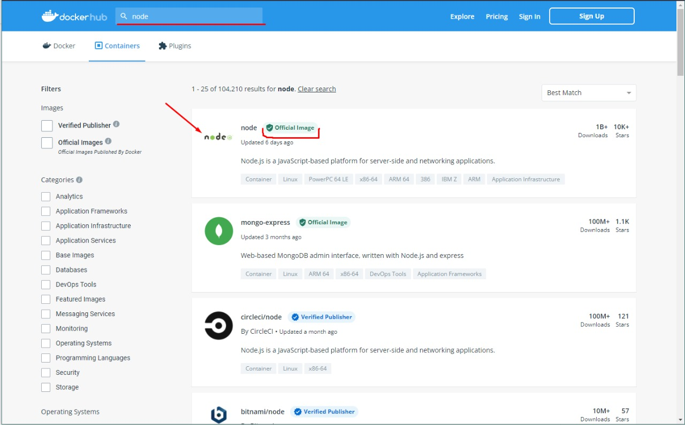
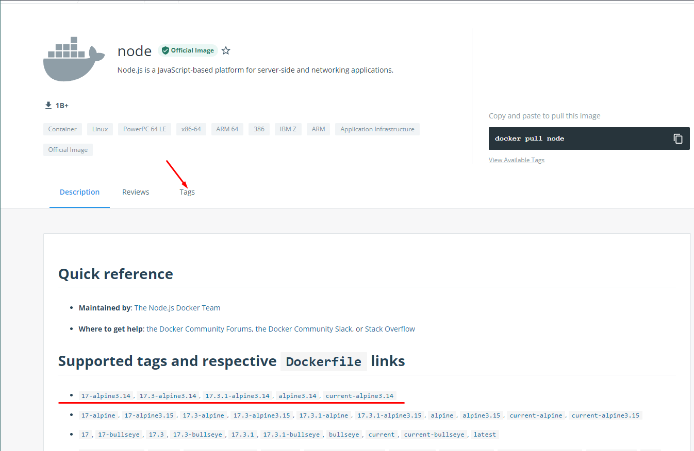
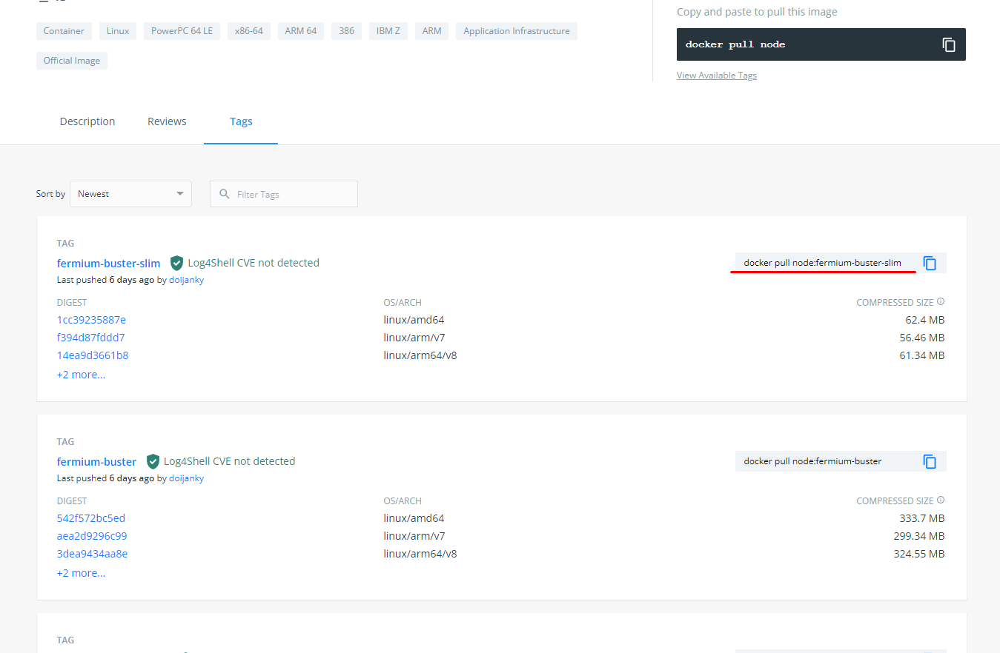
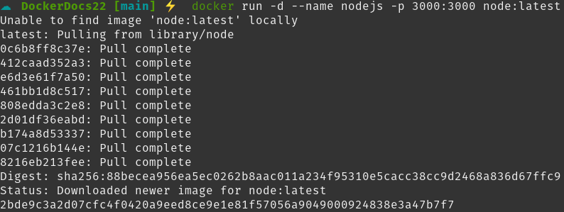
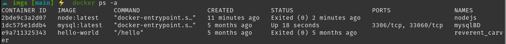
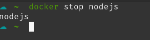
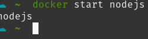
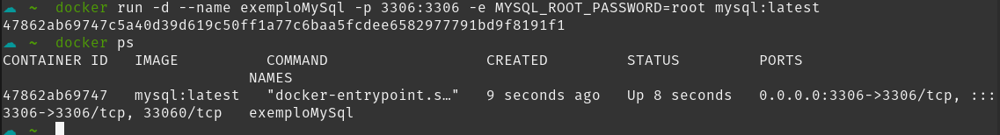
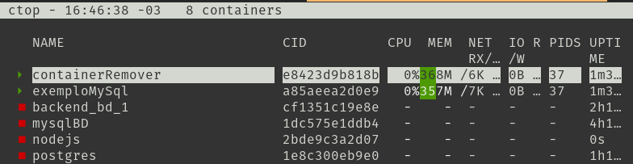
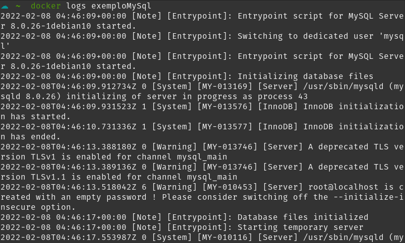

# Introdução

### Imagens
- Imagens são utilizadas para instanciarmos o container, podemos pegar imagens já prontas e oficiais do Docker no site do [DockerHub](https://hub.docker.com) ou criar as nossas próprias utilizando Dockerfile, que será abordado mais para frente!
- Para baixar uma imagem do docker hub utilizamos o comando 
```bash
docker pull nome_da_imagem [opções/flags]
```
opcionalmente, também podemos passar a tag da imagem indicada no docker hub se quisermos uma imagem mais específica o comando ficaria dessa forma
```bash
docker pull nome_da_imagem:tag [opções/flags]
```
- Esse comando pode ter flags as principais são:

| flag | significado | função                                                            |
| ---- | ----------- | ----------------------------------------------------------------- |
| -q   | quiet       | desabilitar o modo verbose, ou seja a saida do comando no console |                                                            |

 - um exemplo de utilização, vamos baixar a imagem de um container node para nossa máquina
 
 1. primeiro buscamos o nome da imagem no DockerHub
 
 
 > Note que existe uma insignia verde escrita "oficial image", isso significa que essa imagem é uma imagem curada e mantida por eles, elas provem a base para a utilização sem problemas, além de estarem sempre atualizadas servem de ponto de partida para a maioria dos usuários.
 
 2. 
 
```bash
docker pull node 
```
> Aqui não utilizarei nenhuma flag

 - Caso quisesse uma versão específica do node, você consegue ver as tags acessando o menu de tags da imagem
 
 
 > Você pode observar que o próprio hub te apresenta o comando para baixar a imagem
 
 3. Após a imagem ter sido baixada, podemos listar as imagens presente no nosso sistema utilizando o comando:
 ```bash
 docker image ls
 # ou
 docker images
 ```
 - Caso você não queria fazer o processo de baixar uma imagem para só depois rodar o container, você pode fazer o download da imagem direto na instanciação do container, como abordaremos no nosso próximo tópico
---

### Instanciação do Container
- O Docker por padrão, sempre busca a imagem para subir o container primeiramente de forma local, caso não encontre nenhuma imagem localmente, ele então passa a buscar online no DockerHub, baixa ela, e então instancia o container

- Para instanciar um container, utilizamos o comando
```bash
docker run [opções/flags] nome_da_imagem
```
>O comando docker *run*, na realidade faz a função de outros dois comandos simultaneamente, o *docker create* e o *docker start*, porém podemos utilizar o run sem problemas : )

- Esse comando possuí diversas flags porém vamos ver as principais aqui

| Flag      | Significado           | Paramêtros                                                                     | função                                                                                                                                                                                                                         |
| --------- | --------------------- | ------------------------------------------------------------------------------ | ------------------------------------------------------------------------------------------------------------------------------------------------------------------------------------------------------------------------------ |
| --rm      | Remover               | nenhum                                                                         | Automaticamente remove o container quando ele terminar/parar                                                                                                                                                                   |
| -d        | Desacoplar (detach)   | nenhum                                                                         | Roda o container em background e retorna o id                                                                                                                                                                                  |
| --name    | Nome do container     | nome que deseja para o container (o docker gera um nome aleatório se não usar) | Permite nomear o container que será criado                                                                                                                                                                                     |
| -v        | Volumes               | pastHost:pastContainer (./data:/usr/share/www)                                 | Vincula o ponto de montagem dos volumes, a pasta local com a pasta interna do container                                                                                                                                        |
| -p        | Publicar portas       | portaHost:portaContainer (7777:3306)                                           | Torna pública uma porta para o host, deixando o container acessível deve ser usado da seguinte forma  portaHost:portaContainer, mapeia portas                                                                                  |
| -e        | Variáveis de ambiente | VARIAVEL_AMBIENTE=valor  (-e POSTGRES_PASSWORD=password)                       | Responsável por setar variáveis de ambiente ao container                                                                                                                                                                       |
| -t        | Terminal              | nenhum                                                                         | Acopla um pseudo-terminal ao container                                                                                                                                                                                         |
| -i        | Iterativo             | nenhum                                                                         | O processo não vai ser finalizado até a conclusão                                                                                                                                                                              |
| --network | Rede                  | nome da rede criada                                                            | Conecta o container a uma rede específica de container                                                                                                                                                                         |
| --link    | Vincular              | nome do container                                                              | Vincula um container a outro ou outros containers, podendo substituir o ip nos projetos pelo nome do container                                                                                                                 |
| --restart | reiniciar             | opções:  {no,on-failure,on-failure:máximoTentativas,unless-stopped,always}     | Define a política para reiniciar o container, padrão é *no*, ou seja, o docker nunca vai reiniciar o container, as outras políticas definem a condição para que o docker reinicie o container baseado em quando ele parar/sair |

> A flag -i pode ser combinada com a flag t e/ou com a flag -d, ficando *-dit*

- Um exemplo de docker run utilizando uma imagem node que não existe localmente e alguma das flags descritas

- Após instanciarmos um container, ou vários containers, podemos listar os containers ativos usando o comando:
```bash
docker ps
```
- Caso você queira listar todos os containers que você tem criado e informações específicas de cada um, basta usar o comando:
```bash
docker ps -a
```

- Para pararmos a execução de um container utilizamos o comando
```bash
docker stop nome_container|id_container
```

- E após pararmos um container, ou quando iniciamos nosso computador, para subir um iniciar um container criado, utilizamos
```bash
docker start nome_container|id_container
```


Nessa momento, já sabemos como procurar imagens na internet e onde encontra-las, também aprendemos a instanciar, parar e subir novamente um container!
- Subimos um container node, para demonstrar como funciona, porém, esse container node, ainda não terá tanta utilidade, voltaremos a utilizar ele mais para frente quando falarmos de Dockerfile, porém, vamos agora, fazer a instanciação completa de um container com uma coisa que para nós programadores é de suma importância, um SGBD, ao invés de baixarmos diversos gerenciadores, podemos ter várias imagens configuradas e só subirmos quando e qual for necessária!

- Vamos começar com o MySQL e no final do documento teremos um exemplo com o Postgres, pois conseguiremos exercitar diversas flags e conceitos!
Como vimos, devemos sempre começar pela imagem, nesse exemplo, utilizaremos a imagem oficial do DockerHub [disponível nesse link](https://hub.docker.com/_/mysql?tab=description)
- Tendo escolhido nossa imagem, podemos rodar o seguinte comando para instanciar nosso container, tendo em mente, que optamos pelo donwload da imagem na nuvem
```bash
docker run -d --name exemploMySql -p 3306:3306 -e MYSQL_ROOT_PASSWORD=root mysql:latest
```
*Observação a variável de ambiente **MYSQL_ROOT_PASSWORD** é obrigatória para definirmos a senha padrão de acesso ao bd, e essa variável está na documentação oficial da imagem, o usuário por padrão do mysql é o **root** * 
- Ao rodarmos esse comando e logo na sequência 
```bash
 docker ps
```
- Obtemos o seguinte retorno no terminal

- Podemos visualizar também os container ativos e desativos por uma interface, como, por exemplo do [ctop](https://github.com/bcicen/ctop), em verde todos os containers rodando, e em vermelho, o que estão parados

- Podemos ver os logs desse container rodando utilizando o comando
```bash
docker logs exemploMysql
```
e temos de retorno do comando todos os logs que o container emitiu

- Na sequência, precisamos executar alguns comandos, como por exemplo rodar um script para criar nosso banco de dados e nossa tabela, existem diversas formas para se fazer isso, nesse exemplo, vamos passar um script sql para nosso banco de dados, esses script foi previamente criado e não entraremos em detalhe de como criá-lo pois não é o nosso foco, após isso entraremos no banco para vermos se tudo foi executado corretamente, para isso, precisamos usar o comando **docker exec**, que vamos detalhar abaixo:
```bash
docker exec [FLAGS] container [COMANDO]
```
- *O docker exec aceita qualquer comando Linux ou referente a imagem como o mysql*

| **flag** | **significado** | **paramêtros** | **função**                                                                                            |
| -------- | --------------- | -------------- | ----------------------------------------------------------------------------------------------------- |
| -i       | Interativo      | Nenhum         | Mantém a interação no terminal enquanto o comando do container está em execução                       |
| -t       | TTY (terminal)  | nenhum         | Aloca um terminal ao container
|          |                 |                |                                                                                                       |

- Nesse nosso exemplo, vamos passar o comando de conexão ao banco mysql com o usuário e a senha e logo após com o operador < passamos o arquivo para ser executado pelo mysql, dessa forma nosso banco será criado.
```bash
docker exec -i newExemplo mysql -uroot -proot < exemplo.sql
```
- Para vermos se o banco foi criado, temos diversas formas de fazer, mas iremos via terminal, para isso precisaremos acessar o mysql via linha de comando e passar os comandos para visualização de banco de dados e tabelas!
- Segue o fio:
```bash
# Instanciando o terminal e acessando o mysql
docker exec -it newExemplo mysql -uroot -proot

# Dentro do terminal do mysql digitamos para vermos se o banco está criado
show databases;
# Após isso executamos para ver se nossa tabela está criada corretamente dentro do banco
use teste; show tables;
# Após isso podemos usar o select e confirmar se os dados foram inseridos corretamentes
select * from pessoa;
# E finalmente para sairmos do terminal basta digitar o comando
exit
```


# Dockerfile
## O que é?
- Dockerfile nada mais é do que um arquivo onde conseguimos especificar todos os comandos que poderiamos passar pela linha de comando para criarmos nossa própria imagem
- Após escrevermos todas as instruções basta rodar o comando 
```
docker build -f [file] -t [tagname] [PATH] 
```
| **flag** | **significado** | **parâmetro**      | **função**                                                                                                                                                                                                                                |
| -------- | --------------- | ------------------ | ----------------------------------------------------------------------------------------------------------------------------------------------------------------------------------------------------------------------------------------- |
| -f       | file            | nome do Dockerfile | Especificar qual o arquivo vai servir de base para a construção da imagem, por padrão, o docker build procura no contexto o arquvio chamado Dockerfile, mas através desse comando pode-se especificar outro caminho para outra dockerfile |
| -t       | tagname         | nome da imagem (name:tag)     | Especificar qual será o nome customizado da imagem, a tag que vem após o nome é opcional                                                                                                                                                                                       |
- Temos também o PATH, o PATH especifica onde encontrar os arquivos para o contexto de criação da imagem, o path pode ser um caminho para pasta, uma url ou até mesmo um repositório do git, aqui, nos limitaremos a trabalhar só com o caminho para pastas locais

## Como é um Dockerfile?
- O Dockerfile, possui diversos comandos para dar suporte a criação de uma imagem customizada, veremos alguns exemplos e detalharemos alguns dos comandos principais!

```Dockerfile
FROM
COPY 
CMD
```

| Instruções    | Função                                                                                                                                                           |
| ---------- | ---------------------------------------------------------------------------------------------------------------------------------------------------------------- |
| FROM       | Ponto de partida para a criação de uma imagem, se quiser algo baseado em Mysql, pode especificar, se quiser fazer uma imagem do zero, basta infromar **SCRATCH** |
| RUN        | Pode ser executada uma ou mais vezes, definimos quais os comandos serão executados nas etapas de criação de uma imagem.                                          |
| CMD        | Definimos quais comandos serão executados na etapa de criação do container, caso o container não tenha nenhum comando                                            |
| ENTRYPOINT | A mesma coisa que o *CMD* porém seus parâmetros não são sobreescritos                                                                                            |
| ADD        | Fazer cópia de arquivos, diretório ou até mesmo baixar arquivos, na máquina host para a imagem                                                                   |
| COPY       | Permite apenas a passagem de arquivos ou diretórios, diferente do *ADD* que permite downloads                                                                    |
| EXPOSE     | Serve para documentar qual a porta será exposta, mas efetivamente **não** publica a porta                                                                        |
| VOLUME     | Cria uma pasta que será compartilhada entre o container e o host                                                                                                 |
| WORKDIR    | Tem o propósito de definir onde as instruções acima executarão suas tarefas, além de definir o diretório padrão que será aberto ao executarmos o container       |

- Agora, vamos a um exemplo prático de como utilizar essas instruções!
