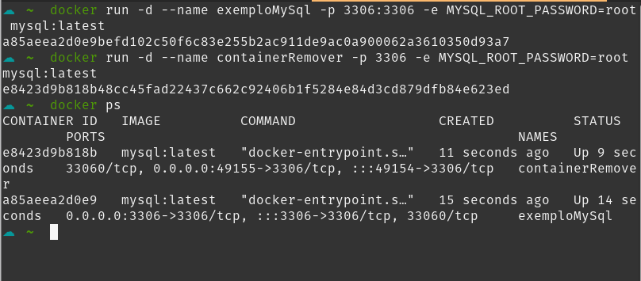

# Introdução

### Imagens
- Imagens são utilizadas para instanciarmos o container, podemos pegar imagens já prontas e oficiais do Docker no site do [DockerHub](https://hub.docker.com) ou criar as nossas próprias utilizando Dockerfile, que será abordado mais para frente!
- Para baixar uma imagem do docker hub utilizamos o comando 
```bash
docker pull nome_da_imagem [opções/flags]
```
opcionalmente, também podemos passar a tag da imagem indicada no docker hub se quisermos uma imagem mais específica o comando ficaria dessa forma
```bash
docker pull nome_da_imagem:tag [opções/flags]
```
- Esse comando pode ter flags as principais são:

| flag | significado | função                                                            |
| ---- | ----------- | ----------------------------------------------------------------- |
| -q   | quiet       | desabilitar o modo verbose, ou seja a saida do comando no console |                                                            |

 - um exemplo de utilização, vamos baixar a imagem de um container node para nossa máquina
 
 1. primeiro buscamos o nome da imagem no DockerHub
 
 
 > Note que existe uma insignia verde escrita "oficial image", isso significa que essa imagem é uma imagem curada e mantida por eles, elas provem a base para a utilização sem problemas, além de estarem sempre atualizadas servem de ponto de partida para a maioria dos usuários.
 
 2. 
 
```bash
docker pull node 
```
> Aqui não utilizarei nenhuma flag

 - Caso quisesse uma versão específica do node, você consegue ver as tags acessando o menu de tags da imagem
 
 
 > Você pode observar que o próprio hub te apresenta o comando para baixar a imagem
 
 3. Após a imagem ter sido baixada, podemos listar as imagens presente no nosso sistema utilizando o comando:
 ```bash
 docker image ls
 # ou
 docker images
 ```
 - Caso você não queria fazer o processo de baixar uma imagem para só depois rodar o container, você pode fazer o download da imagem direto na instanciação do container, como abordaremos no nosso próximo tópico
---

### Instanciação do Container
- O Docker por padrão, sempre busca a imagem para subir o container primeiramente de forma local, caso não encontre nenhuma imagem localmente, ele então passa a buscar online no DockerHub, baixa ela, e então instancia o container

- Para instanciar um container, utilizamos o comando
```bash
docker run [opções/flags] nome_da_imagem
```
>O comando docker *run*, na realidade faz a função de outros dois comandos simultaneamente, o *docker create* e o *docker start*, porém podemos utilizar o run sem problemas : )

- Esse comando possuí diversas flags porém vamos ver as principais aqui

| Flag      | Significado           | Paramêtros                                                                     | função                                                                                                                                                                                                                         |
| --------- | --------------------- | ------------------------------------------------------------------------------ | ------------------------------------------------------------------------------------------------------------------------------------------------------------------------------------------------------------------------------ |
| --rm      | Remover               | nenhum                                                                         | Automaticamente remove o container quando ele terminar/parar                                                                                                                                                                   |
| -d        | Desacoplar (detach)   | nenhum                                                                         | Roda o container em background e retorna o id                                                                                                                                                                                  |
| --name    | Nome do container     | nome que deseja para o container (o docker gera um nome aleatório se não usar) | Permite nomear o container que será criado                                                                                                                                                                                     |
| -v        | Volumes               | pastHost:pastContainer (./data:/usr/share/www)                                 | Vincula o ponto de montagem dos volumes, a pasta local com a pasta interna do container                                                                                                                                        |
| -p        | Publicar portas       | portaHost:portaContainer (7777:3306)                                           | Torna pública uma porta para o host, deixando o container acessível deve ser usado da seguinte forma  portaHost:portaContainer, mapeia portas                                                                                  |
| -e        | Variáveis de ambiente | VARIAVEL_AMBIENTE=valor  (-e POSTGRES_PASSWORD=password)                       | Responsável por setar variáveis de ambiente ao container                                                                                                                                                                       |
| -t        | Terminal              | nenhum                                                                         | Acopla um pseudo-terminal ao container                                                                                                                                                                                         |
| -i        | Iterativo             | nenhum                                                                         | O processo não vai ser finalizado até a conclusão                                                                                                                                                                              |
| --network | Rede                  | nome da rede criada                                                            | Conecta o container a uma rede específica de container                                                                                                                                                                         |
| --link    | Vincular              | nome do container                                                              | Vincula um container a outro ou outros containers, podendo substituir o ip nos projetos pelo nome do container                                                                                                                 |
| --restart | reiniciar             | opções:  {no,on-failure,on-failure:máximoTentativas,unless-stopped,always}     | Define a política para reiniciar o container, padrão é *no*, ou seja, o docker nunca vai reiniciar o container, as outras políticas definem a condição para que o docker reinicie o container baseado em quando ele parar/sair |

> A flag -i pode ser combinada com a flag t e/ou com a flag -d, ficando *-dit*

- Um exemplo de docker run utilizando uma imagem node que não existe localmente e alguma das flags descritas

- Após instanciarmos um container, ou vários containers, podemos listar os containers ativos usando o comando:
```bash
docker ps
```
- Caso você queira listar todos os containers que você tem criado e informações específicas de cada um, basta usar o comando:
```bash
docker ps -a
```

- Para pararmos a execução de um container utilizamos o comando
```bash
docker stop nome_container|id_container
```

- E após pararmos um container, ou quando iniciamos nosso computador, para subir um iniciar um container criado, utilizamos
```bash
docker start nome_container|id_container
```


Nessa momento, já sabemos como procurar imagens na internet e onde encontra-las, também aprendemos a instanciar, parar e subir novamente um container!
- Subimos um container node, para demonstrar como funciona, porém, esse container node, ainda não terá tanta utilidade, voltaremos a utilizar ele mais para frente quando falarmos de Dockerfile, porém, vamos agora, fazer a instanciação completa de um container com uma coisa que para nós programadores é de suma importância, um SGBD, ao invés de baixarmos diversos gerenciadores, podemos ter várias imagens configuradas e só subirmos quando e qual for necessária!

- Vamos começar com o MySQL e no final do documento teremos um exemplo com o Postgres, pois conseguiremos exercitar diversas flags e conceitos!
Como vimos, devemos sempre começar pela imagem, nesse exemplo, utilizaremos a imagem oficial do DockerHub [disponível nesse link](https://hub.docker.com/_/mysql?tab=description)
- Tendo escolhido nossa imagem, podemos rodar o seguinte comando para instanciar nosso container, tendo em mente, que optamos pelo donwload da imagem na nuvem
```bash
docker run -d --name exemploMySql -p 3306:3306 -e MYSQL_ROOT_PASSWORD=root mysql:latest
```
*Observação a variável de ambiente **MYSQL_ROOT_PASSWORD** é obrigatória para definirmos a senha padrão de acesso ao bd, e essa variável está na documentação oficial da imagem, o usuário por padrão do mysql é o **root** * 
- Ao rodarmos esse comando e logo na sequência 
```bash
 docker ps
```
- Obtemos o seguinte retorno no terminal

- Podemos visualizar também os container ativos e desativos por uma interface, como, por exemplo do ctop, em verde todos os containers rodando, e em vermelho, o que estão parados
